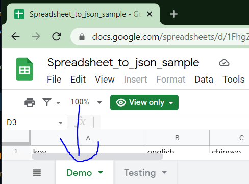

# 📜 Spreadsheet to JSON converter

**This is a python scripts for retrieving Google spreadsheet content and convert data into JSON files**

Use case:
* Get a list of user responses for each question from a Google Form result
* Generate locale files for you application by getting value from your spreadsheet [[example project spreadsheet](https://docs.google.com/spreadsheets/d/1FhgZIa07IStNoei-Yt61JjJeGh-EIqqMxm6vLE85_wc/edit#gid=0)]


## 🔨 Installation
### Prerequisites
* **Python** - Version 3.7 or [greater](https://www.python.org/downloads/)
* **The [pip](https://pypi.org/project/pip/) package management tool**
* **Google Account**

### Basic usage
Install virtualenv via pip:
```
$ pip install virtualenv
```
Test your installation:
```
$ virtualenv --version
```
<br>

1. Create a virtual environment for a project
```
$ cd project_folder
$ virtualenv venv
```

2. To begin using the virtual environment, it needs to be activated
```
$ source venv/bin/activate

window platform:
venv\Scripts\activate
```

3. Install dependencies
```
$ pip install -r requirements.txt
```

4. Create a `.env` file, you can refer `.env.example` file or [environment configuration below](#required-variables)

5. Get login credential JSON file from Google Cloud Spreadsheet service and save the file to `./data` directory  
ps: You can get the file from [this steps](https://developers.google.com/sheets/api/quickstart/python?authuser=1#step_1_turn_on_the)
   
## ⚙️ Config Environment Variables
### Required variables
| Key                     | Type   |  Description                                                                                                                                                                                                                     |
|-------------------------|--------|----------------------------------------------------------------------------------------------------------------------------------------------------------------------------------------------------------------------------------|
| SOURCE_1_NAMESPACE      | String | An identifier for the current task, also the output folder name in your output directory.                                                                                                                                        |
| SOURCE_1_SPREADSHEET_ID | String | Your Google Spreadsheet sheet ID number.<br> E.g. `https://docs.google.com/spreadsheets/d/1FhgZIa07IStNoei-Yt61JjJeGh-EIqqMxm6vLE85_wc/edit#gid=0` <br /><br /> `SOURCE_1_SPREADSHEET_ID = 1FhgZIa07IStNoei-Yt61JjJeGh-EIqqMxm6vLE85_wc` |
| SOURCE_1_SHEET_NAME     | String | The Google Spreadsheet sheet name that you want to get data from. <br /> E.g. `SOURCE_1_SHEET_NAME = Demo` <br /><br />                            |

### Optional variables
| Key                             | Type   | Description                                                                                                                                                                                                                                                                                                                                                                                          | Default                     |
|---------------------------------|--------|------------------------------------------------------------------------------------------------------------------------------------------------------------------------------------------------------------------------------------------------------------------------------------------------------------------------------------------------------------------------------------------------------|-----------------------------|
| SOURCE_1_SHEET_PRIMARY_KEY_NAME | String | A unique key for your record also the key value for your json object, the script will auto select A1 column value from your spreadsheet if this variable is not set.                                                                                                                                                                                                                         | Spreadsheet A1 column value |
| SOURCE_1_SHEET_CUSTOM_RANGE     | String | Sheet range that you would like to export only.<br>E.g. `SOURCE_1_SHEET_CUSTOM_RANGE = B1:O`  means highlight from `B1` column to entire `o` column<br><br>Refers [Google Spreadsheet range annotation guide](https://developers.google.com/sheets/api/guides/concepts#a1_notation) for more details                                                                                                 |                             |
| LOCALHOST_PORT                  | Int    | Google OAuth 2.0 service authentication page hosting port number.                                                                                                                                                                                                                                                                                                                                    | 0                           |
| EMPTY_DATA_FILTER               | Bool   | This value is for removing empty values in your record.                                                                                                                                                                                                                                                                                                                                              | False                       |
| CREDENTIAL_FILE_NAME            | String | The credential file that provided by Google Cloud when enabling the Spreadsheet API service.  <br>E.g. `credentials.json -> SOURCE_1_CREDENTIAL_FILE_NAME = credentials`<br><br>Refers [Google Spreadsheet documentation](https://developers.google.com/sheets/api/quickstart/python?authuser=1#step_1_turn_on_the) steps to get the credential file.<br><br>***Note: Exclude file extension name*** | credentials                 |
| ACCESS_TOKEN_FILE_NAME          | String | File name that store your session access token.<br>                                                                                                                                                                                                                                                                                                                                                  | token                       |

> **Extra environment variables**  
> This script reserve another sets of environment variable to perform 2 jobs in 1 script run.   
> Below are the extra environment variables:
> - SOURCE_2_NAMESPACE
> - SOURCE_2_SHEET_NAME
> - SOURCE_2_SPREADSHEET_ID
> - SOURCE_2_SHEET_PRIMARY_KEY_NAME
> - SOURCE_2_SHEET_CUSTOM_RANGE  
> 
> Note: You can add more variables and modify the scripts based on your needs

## 🎄 Additional Configuration
Additional configuration files settings 

_Ps: These are not environment variables_  
**Note: Both configuration files(JSON) mention below must be stored in `/data` directory**

> **artifact-export-lookup-table.json**   
> This file teaches the script how to export the result you get from the spreadsheet
> ``` 
> {
>   "english": "locale-en", // "column_name": "export_file_name_ONLY_without_file_extention"
>   "chinese": "locale-zh"
> }
> ```

> **preset-directory.json**  
> Render pre-defined output directory profile selection interface(CLI)
> ``` 
> {
>   "directories": [
>       {
>           "index": "1", <------------------------------ The selection ID,
>           "name": "Profile 1", <----------------------- The Selection display name
>           "path": "D:\\SpreadsheetExport\\Profile1" <-- Output base directory absolute file path
>       },
>       {
>           "index": "2",
>           "name": "Profile 2",
>           "path": "D:\\SpreadsheetExport\\Profile2"
>       }
>   ]
> }
> ```

> **Environment file support**  
> This project uses [python-decouple 3.4](https://pypi.org/project/python-decouple/) for environment variable control  
> Supported environment variable file:  
> 1. `ini` file
> 2. `.env` file (author selection)

## 🩹 Limitation
- Only design to export JSON file
- Unable to performs multiples sheet range data capture and column data formatting feature which supported by 
  Google Spreadsheet.

Happy Coding~ you can modify the script based on your needs 🏀

## ⚔️ Contributing
Pull requests are welcome.

### Commit message format
We are following [Semantic Commit Messages](https://gist.github.com/joshbuchea/6f47e86d2510bce28f8e7f42ae84c716) approach   
Format: `<type>: <subject>`
```
feat: add hat wobble
^--^  ^------------^
|     |
|     +-> Summary in present tense.
|
+-------> Type: chore, docs, feat, fix, refactor, style, or test.
```
- feat: (new feature for the user, not a new feature for build script)
- fix: (bug fix for the user, not a fix to a build script)
- docs: (changes to the documentation)
- style: (formatting, spacing, etc; no production code change)
- refactor: (refactoring production code, eg. renaming a variable)
- test: (adding missing tests, refactoring tests; no production code change)
- chore: (updating grunt tasks etc; no production code change)

### Pull request (PR) title and description formatting
The title of the PR same as commit message format [above](#commit-message-format)  
The PR description can be added for more context references

### Linting
Please use linting tools below to ensure your pull request compliance with [PEP 8](https://www.python.org/dev/peps/pep-0008/) standard 
- SonarLint
- Pylint

Note: The maintainer reserved the rights to NOT merge the PR, if failed to follow any requirement listed above

## 🎊 Authors and Acknowledgment
- cjdriod [ [jacklim.cj@gmail.com](mailto:jacklim.cj@gmail.com) ]

## 📝 License

